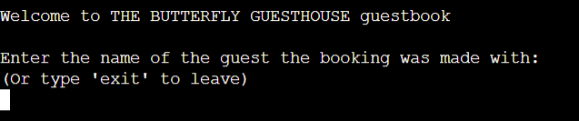
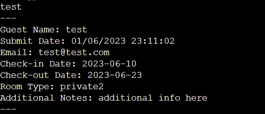

# Butterfly Guesthouse Booking (BFGbooking)

BFGbooking is a simple terminal*based python application to search for guest bookings at Butterfly Guesthouse.

The application is connected to a google spreadsheet that is populated by guests filling in the booking form on the Butterfly Guesthouse website.

## Features

* Welcome and Prompt
    * The app opens to a welcome message and a prompt requesting the user to input the name of the guest they wish to search for.
    * This is vry straightforward and clearly directs the user on what to do, even prompting them how to exit if they wish to do.

* Wrong Entry
    * If the entry isn't found in the directory the user is alerted and promted to try again.
    * Again, this is very straight forward. No name other than the exact one the room has been booked with will be accepted.

* Guest Found
    * When a guest is found all information they input into the webpage form is called up.
    * As is expected when a matching name is inputted the relevant information for the guest is delivered to the user to confirm the details of the booking.

## Testing
I manually tested the project using the following methods:

* Tested python code through a PEP8 Linter and fixed any errors. The website pep8online.com was down at the time of testing, so as a workaround, I addeda PEP8 validator to my Gitpod Workspace directly by following these steps:
    * Run the command pip3 install pycodestyle  Note that this extension may already be installed, in which case this command will do nothing.
    * In your workspace, press Ctrl+Shift+P (or Cmd+Shift+P on Mac).
    * Type the word linter into the search bar that appears, and click on Python: Select Linter from the filtered results.
    * Select pycodestyle from the list.
    * PEP8 errors will now be underlined in red, as well as being listed in the PROBLEMS tab beside your terminal.

## Validation
* PEP8
Only 1 Error "line too long (90 > 79 characters)" left as I felt this was okay to ignore for the sake of the line's presentation on the terminal.

## Deployment
The site was deployed via [Heroku](https://dashboard.heroku.com/apps), and the live link can be found here: https://python*hngmn.herokuapp.com/

This project was developed utilising the Code Institute Template. Some of the deployment steps below are specifically required for the new CI template and may not be applicable to older versions, or different projects.

Before deploying to Heroku pip3 freeze > requirements.txt was used to add Colorama imports for deployment.

* Log in to Heroku or create an account if required.

* Then, click the button labelled New from the dashboard in the top right corner and from the drop*down menu select Create New App.

* You must enter a unique app name, (I used mastermind*code*breaker).

* Next, select your region, (I chose Europe as I am in Ireland).

* Click on the Create App button.

* The next page you will see is the project’s Deploy Tab. Click on the Settings Tab and scroll down to Config Vars.

* Click Reveal Config Vars and enter PORT into the Key box and 8000 into the Value box and click the Add button.

* Next, scroll down to the Buildpack section click Add Buildpack select python and click Save Changes.

* Repeat step 8 to add node.js. o Note: The Buildpacks must be in the correct order. If not click and drag them to move into the correct order.

* Scroll to the top of the page and now choose the Deploy tab.

* Select Github as the deployment method.

* Confirm you want to connect to GitHub.

* Search for the repository name and click the connect button.

* Scroll to the bottom of the deploy page and select preferred deployment type:

* Click either Enable Automatic Deploys for automatic deployment when you push updates to Github.

* Select the correct branch for deployment from the drop*down menu and click Deploy Branch for manual deployment.